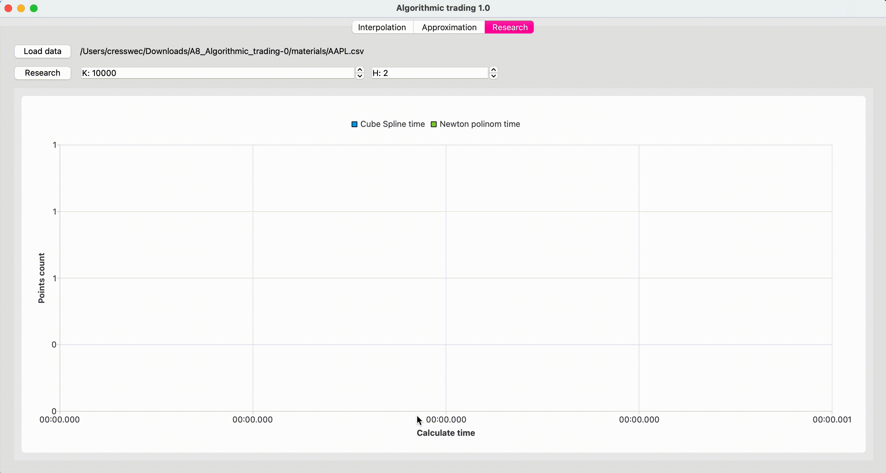

# AlgorithmTrading in Qt/CPP
This is a C++ program for plotting tabulated functions of stock quotes using interpolation and approximation methods. It allows you to load data from a .csv file, plot the data using the cubic spline interpolation method, and approximate the data using the least squares method with a polynomial of a chosen degree.


## Dependencies

- C++17
- QT5 or QT6 (Widgets, LinguistTools, Charts, Concurrent, Core)

## Installation

1. Clone the repository:

```
git clone https://github.com/your_username/AlgorithmTrading.git
```

2. Install dependencies:

   * On Ubuntu:

   ```
   sudo apt-get install build-essential qt5-default cmake
   ```

   * On MacOS:

   ```
   brew install qt cmake
   ```

3. Build the program:

   ```
   cd AlgorithmTrading
   cmake -S ./ -B ./build
   cmake --build ./build
   ```

4. Run the program:

   ```
   cd ./build
   ./AlgorithmTrading
   ```

## Usage

### Opening a file in the app

To start working, you need to open a file by clicking on the `Open` button in one of the three tabs of the application. The file must be in `.csv` format and contain columns with the following data:

- Date (format: `yyyy-MM-dd`, required)
- Function value (format: `double`, required)
- Weight (format: `double`, optional)

Examples of input data:

```
Date,Close
2021-03-22,123.389999
2021-03-23,122.540001
2021-03-24,120.089996
...
```

```
Date,Close,Weight
2021-03-22,12.85,1.22387
2021-03-23,12.21,0.851246
2021-03-24,12.14,0.80462
...
```

### Cubic Spline Interpolation

1. Load data from a .csv file using the "Load" button.
2. Enter the number of points you want to plot in the "Number of points" field.
3. Click on the "Plot" button to plot the data using the cubic spline interpolation method.
4. To clear the plot, click on the "Clear" button.

*Interpolation* is a method of finding intermediate values of a quantity from a discrete set of known values.

`Newton interpolation polynomial (with the ability to select the degree of the polynomial)` and `Cubic spline interpolation` are two implemented interpolation methods in the project.

The user can place up to five graphs in the graph area at the same time.

Moving around the graph area is implemented by holding down the right mouse button. If you need to return to the initial state, you should double-click the left mouse button.

Clearing can be done by pressing the `Clear all` button (delete all graphs), or by clicking on the `Remove` field in the list of graphs and deleting the required one.

The user can also get the values of the two methods by clicking on the `Value from date` button and selecting the desired date.


### Least Squares Approximation

1. Load data from a .csv file using the "Load" button.
2. Enter the number of points you want to plot in the "Number of points" field.
3. Enter the degree of the polynomial you want to use for the approximation in the "Degree" field.
4. Enter the number of days you want to extend the graph in the "Number of days" field.
5. Click on the "Approximate" button to plot the data using the least squares method with a polynomial of the chosen degree.
6. To clear the plot, click on the "Clear" button.

*Approximation* is the replacement of one mathematical object with others that are in some sense close to the original ones.

`Method of least squares (with the ability to select the degree of the polynomial)` - implemented approximation method in the project.

The user can place up to five graphs in the graph area at the same time.

The user can set the value `M`, which means how many additional days the data will be approximated for.

The user can also get the values of two methods by clicking on the `Value from date` button and selecting the desired date.

It is possible to use weights of points, which can be set in the input `.csv` file. To do this, you need to set the `use users weights` checkbox to the enabled position.

Added the ability to simultaneously build the following 4 graphs:
- With a polynomial degree of 1 for a table where the weights are set by the user
- With a polynomial degree of 2 for a table where the weights are set by the user
- With a polynomial degree of 1 for a table where all weights are equal to 1
- With a polynomial degree of 2 for a table where all weights are equal to 1


## Research

Research on the temporal characteristics of interpolation using `cubic splines` and `Newton's polynomial` depending on the calculated points.

The user sets the maximum number of points `k` and the number of partitions `h`. The minimum value of `k` is the number of entries in the input table. The measurements are repeated `h` times, each performed 10 times, and the arithmetic mean will be calculated.



### Output Values

To output the values of the stock quotes function obtained by interpolation or approximation method according to a user-defined argument value (date and time), enter the value in the "Output Value" field and click on the "Output" button.

## License

This project is licensed under the [MIT License](LICENSE). See the LICENSE file for more details.
